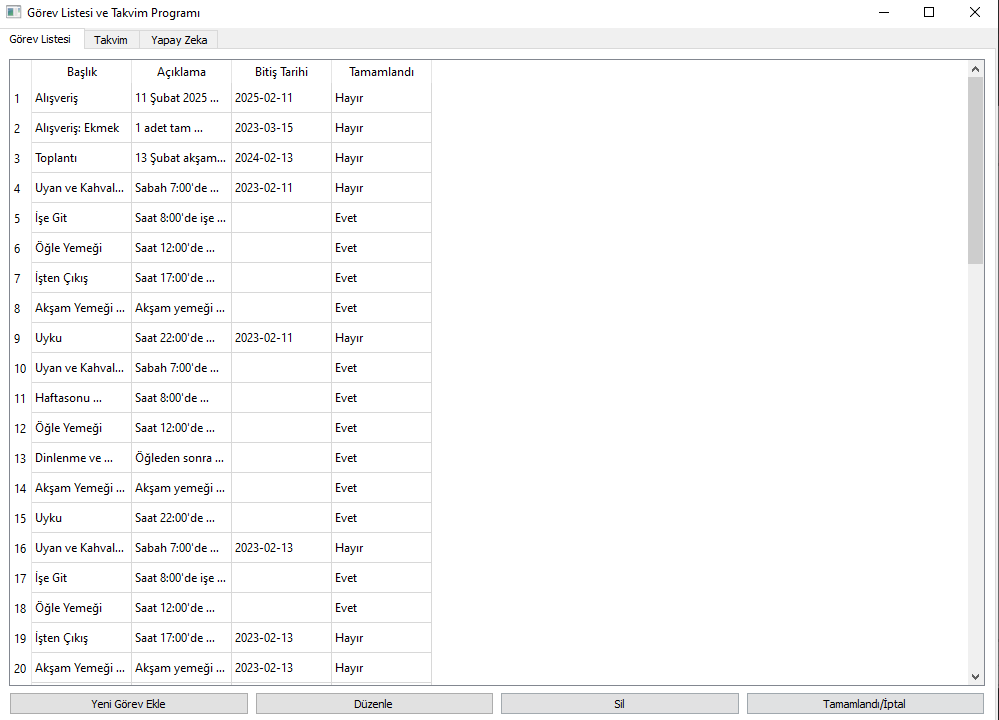
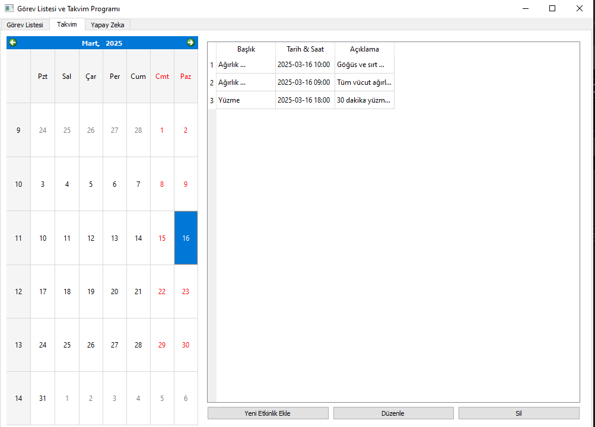
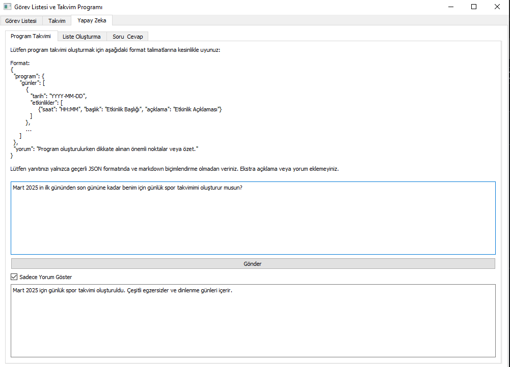
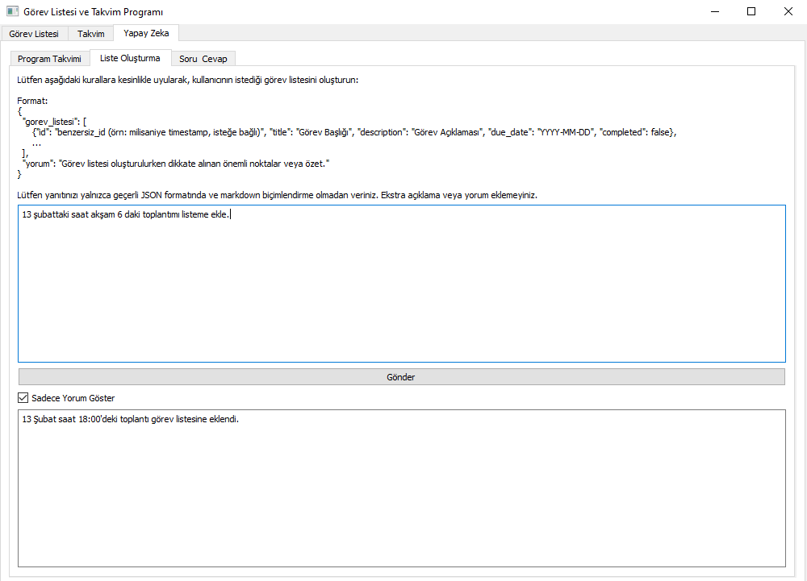
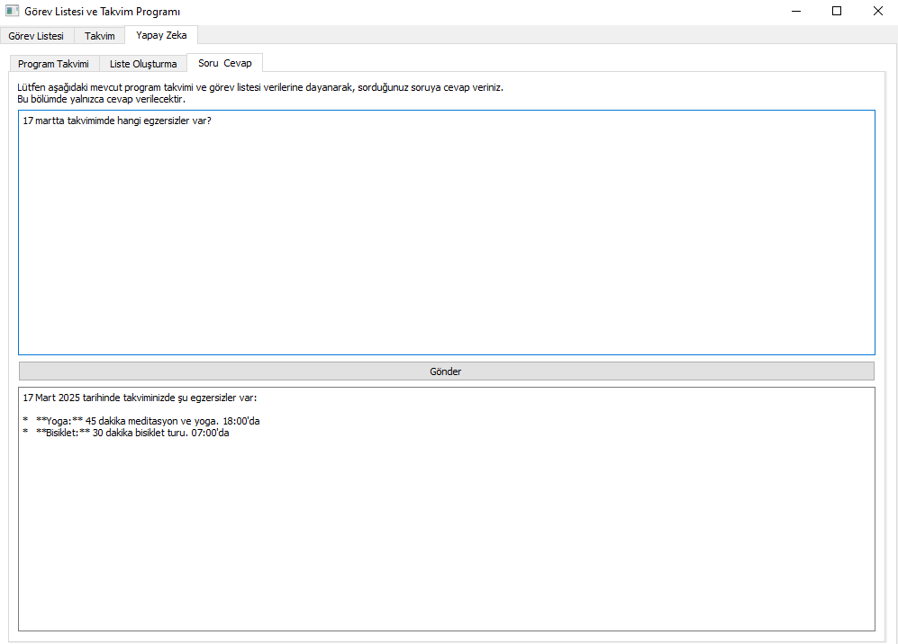
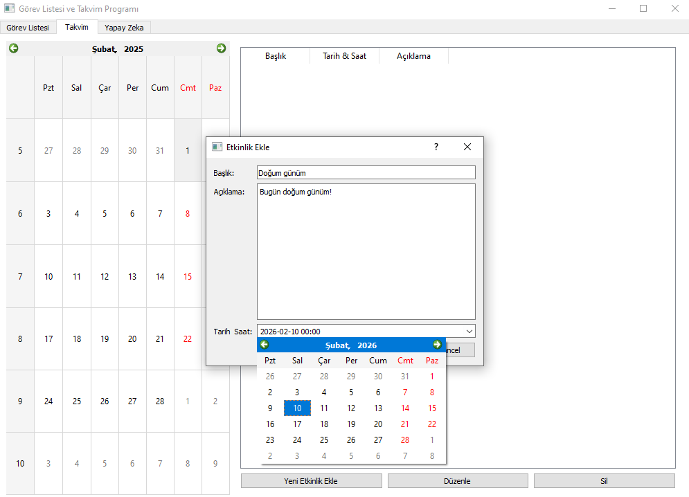

# Görev Listesi ve Takvim Programı

Bu program, PyQt5 ile geliştirilmiş, kullanıcıların görevlerini ve etkinliklerini yönetmelerine yardımcı olan basit bir masaüstü uygulamasıdır. Google Gemini API entegrasyonu sayesinde, yapay zeka destekli görev listeleri ve program takvimleri oluşturabilir, sorularınıza yanıtlar alabilirsiniz.

## Özellikler

*   **Görev Yönetimi:**
    *   Görev ekleme, düzenleme ve silme.
    *   Görevleri tamamlandı olarak işaretleme.
    *   Bitiş tarihine göre görevleri görüntüleme.
*   **Etkinlik Takvimi:**
    *   Etkinlik ekleme, düzenleme ve silme.
    *   Takvim üzerinde etkinlikleri görselleştirme.
    *   Seçilen güne ait etkinlikleri listeleme.
*   **Google Gemini API Entegrasyonu:**
    *   Yapay zeka ile program takvimi oluşturma.
    *   Yapay zeka ile görev listesi oluşturma.
    *   Mevcut veriler üzerinden yapay zekaya soru sorma ve cevap alma.
*   **Sekmelerle Arayüz:**
    *   "Görev Listesi", "Takvim" ve "Yapay Zeka" sekmeleri ile düzenli arayüz.
    *   Yapay Zeka sekmesi altında "Program Takvimi", "Liste Oluşturma" ve "Soru & Cevap" alt sekmeleri.
*   **JSON Formatında Veri Yönetimi:**
    *   Görevler ve etkinlikler `tasks.json` ve `events.json` dosyalarına kaydedilir.
    *   Yapay zeka etkileşimleri JSON formatında talimatlar ve yanıtlar kullanır.
*   **Konfigürasyon Dosyası:**
    *   API anahtarı ve model adı gibi ayarlar `config.json` dosyasından yönetilir.

## Kurulum

1.  **Python ve Gerekli Kütüphaneleri Kurun:**
    Programı çalıştırmak için Python 3 ve aşağıdaki kütüphanelerin kurulu olması gereklidir:

    ```bash
    pip install -r requirements.txt
    ```

    `requirements.txt` dosyası aşağıdaki gibidir:

    ```txt
    PyQt5
    google-generativeai
    ```

2.  **Google Gemini API Anahtarı Alın:**
    Google AI Studio'dan bir API anahtarı almanız ve `config.json` dosyasına eklemeniz gerekmektedir. `config.json` dosyası program ilk kez çalıştırıldığında otomatik olarak oluşturulur. Dosyayı açıp `YOUR_API_KEY` yerine kendi API anahtarınızı yazın.

    ```json
    {
        "gemini_api_key": "YOUR_API_KEY",
        "model": "gemini-2.0-flash"
    }
    ```

3.  **Programı Çalıştırın:**
    ```bash
    python takvim.py
    ```

## Kullanım

Programı çalıştırdıktan sonra aşağıdaki sekmeleri göreceksiniz:

*   **Görev Listesi:** Bu sekmede görevlerinizi ekleyebilir, düzenleyebilir, silebilir ve tamamlandı olarak işaretleyebilirsiniz. "Yeni Görev Ekle", "Düzenle", "Sil" ve "Tamamlandı/İptal" butonlarını kullanabilirsiniz.
*   **Takvim:** Bu sekmede takvim üzerinde etkinliklerinizi görüntüleyebilir ve etkinlik listesini yönetebilirsiniz. Takvimden bir gün seçerek o güne ait etkinlikleri görebilir, "Yeni Etkinlik Ekle", "Düzenle" ve "Sil" butonları ile etkinliklerinizi yönetebilirsiniz.
*   **Yapay Zeka:** Bu sekme üç alt bölümden oluşur:
    *   **Program Takvimi:** Burada yapay zekadan program takvimi oluşturmasını isteyebilirsiniz. İstenilen format ve örnek talimatlar ekranda belirtilmiştir. İsteklerinizi alt kısımdaki metin alanına yazıp "Gönder" butonuna tıklayarak yapay zeka yanıtını alabilirsiniz. "Sadece Yorum Göster" seçeneği ile sadece yapay zeka yorumunu görüntüleyebilirsiniz.
    *   **Liste Oluşturma:** Bu bölümde yapay zekadan görev listesi oluşturmasını isteyebilirsiniz. Format ve talimatlar ekranda belirtilmiştir. İsteklerinizi yazıp "Gönder" butonuna tıklayarak yapay zeka yanıtını alabilirsiniz. "Sadece Yorum Göster" seçeneği burada da mevcuttur.
    *   **Soru & Cevap:** Bu sekmede mevcut program takvimi ve görev listenizle ilgili sorular sorabilirsiniz. Yapay zeka, mevcut verilerinize dayanarak sorularınızı yanıtlayacaktır.

## Ekran Görüntüleri

`screenshots` klasöründe programın ekran görüntülerini bulabilirsiniz. Bu klasöre aşağıdaki gibi ekran görüntüleri ekleyebilirsiniz:

  
  Görev Listesi sekmesinin ekran görüntüsü.
  
  Takvim sekmesinin ve etkinlik listesinin ekran görüntüsü.
  
  Yapay Zeka sekmesinin "Program Takvimi" alt sekmesinin ekran görüntüsü.
  
  Yapay Zeka sekmesinin "Liste Oluşturma" alt sekmesinin ekran görüntüsü.
  
  Yapay Zeka sekmesinin "Soru & Cevap" alt sekmesinin ekran görüntüsü.
  
  Görev Ekleme diyalog penceresinin ekran görüntüsü.
  
  Etkinlik Ekleme diyalog penceresinin ekran görüntüsü.

## Lisans

Bu proje MIT Lisansı altında lisanslanmıştır.
